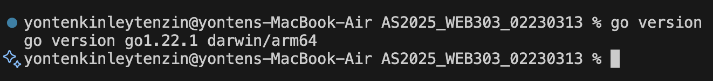
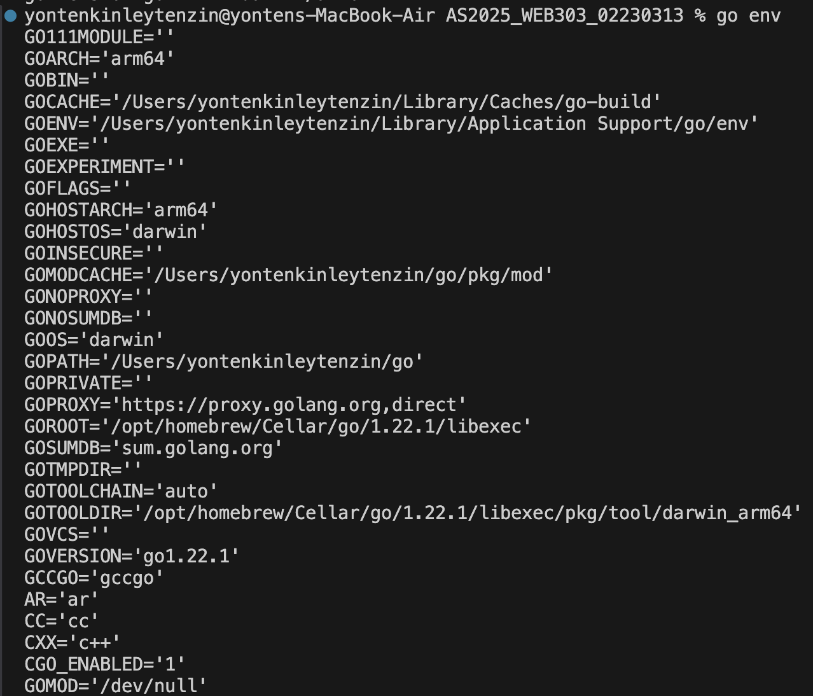
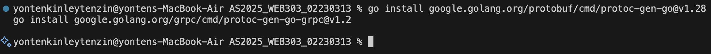
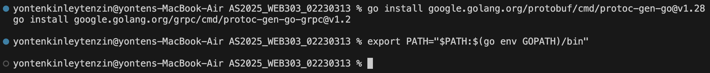
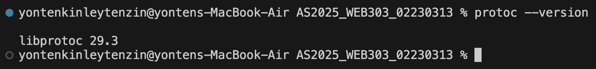
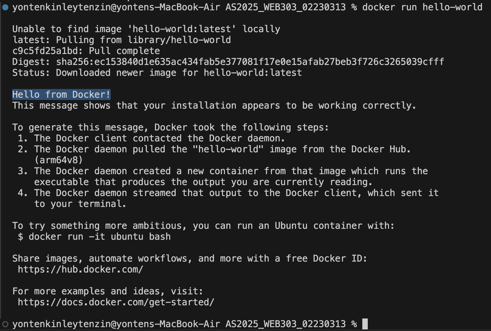
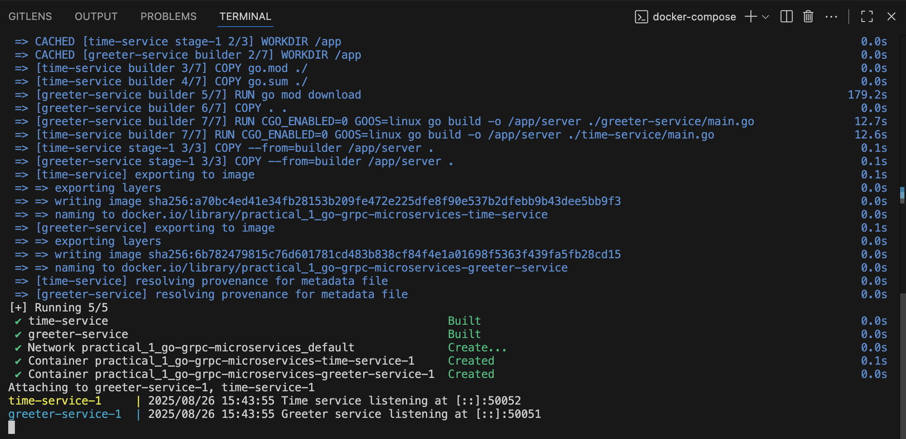
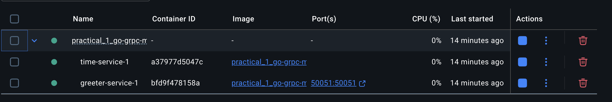
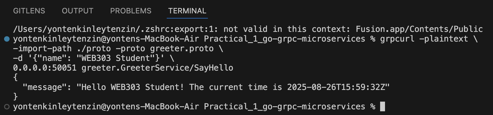

# Practical Report: WEB303 Microservices & Serverless Applications

## Practical 1: From Foundational Setup to Inter-Service Communication

### Module Learning Outcomes Supported
- **LO2:** Design and implement microservices using gRPC and Protocol Buffers.
- **LO6:** Deploy microservices with Docker Compose (foundation for Kubernetes).
- **LO1 (supported):** Explain microservices and serverless concepts.

---

## Foundational Development Environment Setup

**Objective:** Prepare the machine for Go microservice development.

**Steps Taken:**
1. **Installed Go:**  
   - Downloaded from [go.dev](https://go.dev/dl/).
   - Verified installation with `go version` and `go env`.





2. **Installed Protocol Buffers & gRPC Tools:**  
   - Downloaded `protoc` from [GitHub Releases](https://github.com/protocolbuffers/protobuf/releases).
   - Installed Go plugins for Protobuf and gRPC.
   - Updated PATH for Go binaries.







3. **Installed Docker:**  
   - Installed Docker Desktop.
   - Verified with `docker run hello-world`.



**Outcome:**  
All tools installed and verified successfully.

---

## Building and Orchestrating Communicating Microservices

**Objective:** Build two microservices (greeter-service and time-service) that communicate via gRPC, and run them with Docker Compose.

**Steps Taken:**

1. **Project Structure:**  
   - Created folders: `proto`, `greeter-service`, `time-service`, etc.

2. **Service Contracts:**  
   - Defined `time.proto` and `greeter.proto` in the `proto` folder.
   - Generated Go code using `protoc`.

3. **Microservice Implementation:**  
   - **time-service:**  
     - gRPC server returning current time.
   - **greeter-service:**  
     - gRPC server and client; calls time-service and returns greeting with current time.

4. **Containerization:**  
   - Created Dockerfiles for both services.
   - Used multi-stage builds for small images.

5. **Orchestration:**  
   - Created `docker-compose.yml` to run both services together.
   - Set up service dependencies and port mapping.

6. **Testing:**  
   - Used `grpcurl` to call the greeter-service endpoint.
   - Received expected JSON response with greeting and current time.

**Challenges Encountered:**  
- Ensured correct service names and ports in Docker Compose for inter-service communication.
- Managed Go module paths and dependencies for generated code.

**Final Outcome:**  
Both services run successfully in containers, communicate via gRPC, and return the expected response.

---

##  Run and Verify! 

Run Docker Compose: From the root of your practical-one directory, run:

```
docker-compose up --build
```
This command builds and starts both services.





#### Test the Endpoint: To test the flow, we'll use grpcurl.
1. Install grpcurl if you haven't already. You can find installation instructions here.
2. Open new terminal and run the following command to test the greeter service:

```
grpcurl -plaintext \
-import-path ./proto -proto greeter.proto \
-d '{"name": "WEB303 Student"}' \
0.0.0.0:50051 greeter.GreeterService/SayHello
```



---

**GitHub Repository Link:**  

https://github.com/Kinleyjigs/AS2025_WEB303_02230313_Practical1.git

---
